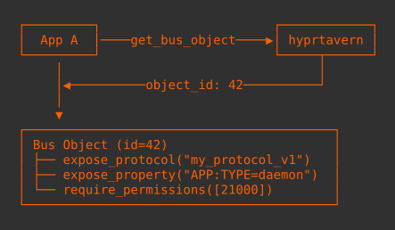
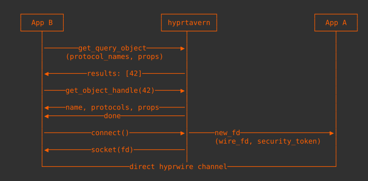
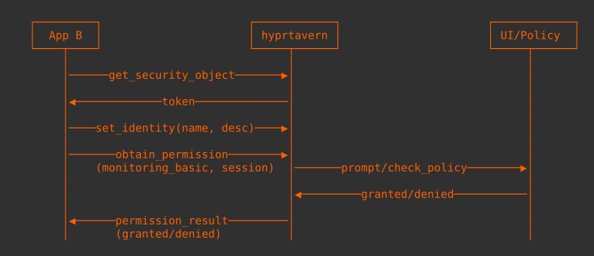
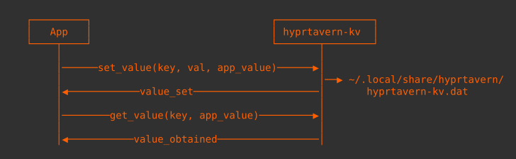

# `hyprtavern`

## Dependencies

```bash
paru -S cmake gcc
paru -S hyprutils-git hyprlang-git hyprwire-git hyprtoolkit-git
```

### Install `hyprwire-protocols`

```bash
git clone -b hyprtavern https://github.com/hyprwm/hyprwire-protocols
cd hyprwire-protocols
cmake -B build
sudo cmake --install build # installs /usr/share/hyprwire-protocols/hyprtavern/
```

## Build & Run

```bash
git clone git@github.com:hyprwm/hyprtavern.git
cd hyprtavern
cmake -B build
cmake --build build
PATH="$PWD/build/barmaids/hyprtavern-kv:$PATH" ./build/hyprtavern
# build/
# ├── hyprtavern (daemon)
# ├── barmaids/ (helpers)
# │   └── hyprtavern-kv/
# │       └── hyprtavern-kv (store)
# └── tools/
#     └── hyprtavern-spy/
#         └── hyprtavern-spy (debugging)
```

**Note**: Encryption isn't implemented yet. To bypass the setup prompt, pre-create the data file:

```bash
mkdir -p ~/.local/share/hyprtavern
echo '{"apps":[],"global":[],"tavern":[]}' > ~/.local/share/hyprtavern/hyprtavern-kv.dat
```

## Architecture

Applications register themselves on the bus as `objects`, each exposing a set of protocols it implements along with discoverable properties. Other applications query the bus to find objects matching specific protocols or properties, receiving object handles that reveal metadata and enable connection. When connecting, hyprtavern passes a file descriptor directly between the two applications, establishing a peer-to-peer hyprwire channel that bypasses the bus entirely for subsequent communication. The permission system operates atomically—applications request permission groups that persist either for the session or permanently, with non-sandboxed apps optionally skipping checks.

### Registration Flow



### Discovery & Connection



### Permission Request Flow



### KV Store Operations



### Protocols

Located in hyprwire-protocols (`hyprtavern` branch):

| Protocol                                     | Purpose             |
| -------------------------------------------- | ------------------- |
| `hp_hyprtavern_core_v1`                      | Core bus operations |
| `hp_hyprtavern_kv_store_v1`                  | Key-value storage   |
| `hp_hyprtavern_permission_authentication_v1` | Security/auth       |

## Common Issues

- "Couldn't load proto: File was not found"

  > You're missing hyprwire-protocols or using the wrong branch

- Missing type `HP_HYPRTAVERN_CORE_V1_FD`

  > Your `hyprwire` version is too old. Install `hyprwire-git`

- `CSetupLineEdit` has no member `password`
  > Your `hyprtoolkit` version is too old. Install `hyprtoolkit-git`
